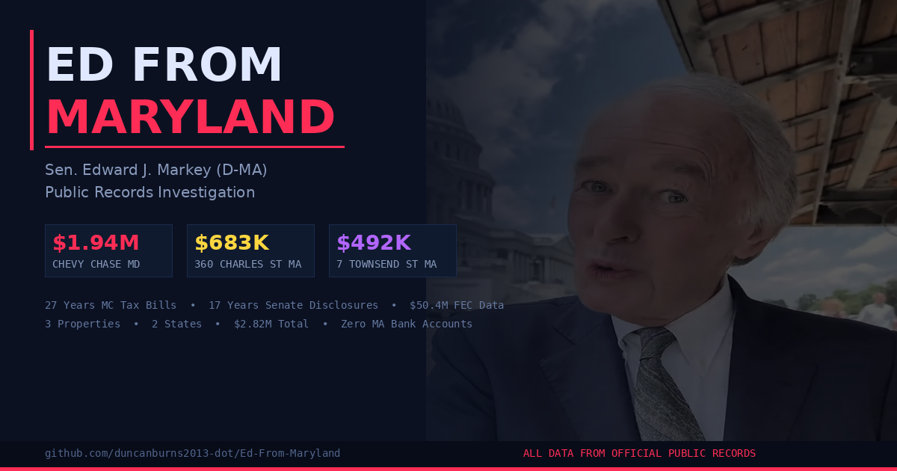

# Ed From Maryland



### A public records compilation on Sen. Edward J. Markey (D-MA)

**[→ View Live Dashboard](https://duncanburns2013-dot.github.io/Ed-From-Maryland/)** &nbsp;|&nbsp; **[→ Full Data & Sources (MASTERDATA.md)](MASTERDATA.md)**

---

## What This Is

A compilation of official government records, sworn financial disclosures, and recorded public documents concerning Sen. Edward J. Markey's property ownership, domicile, financial ties, and campaign finance data.

No anonymous sources. No hearsay. Just the records. Draw your own conclusions.

---

## The Records At A Glance

| What | Finding | Source |
|------|---------|--------|
| **3 Properties** | Chevy Chase MD ($1.94M) + Malden condo ($683K) + Malden house ($492K) = **$2.82M across 2 states** | MD SDAT, Malden Assessor |
| **MC Tax Bills** | Chevy Chase listed as **PRINCIPAL RESIDENCE 1999–2001**, then **NOT A PRINCIPAL RESIDENCE for 24 consecutive years** (2002–2025) | 27 Montgomery County tax bills |
| **Total MC Taxes** | ~$339,000 paid on a property classified as "not principal" — with active solid waste service | MC Tax Bills |
| **Bank Accounts** | **Zero Massachusetts bank accounts** in 17 years of sworn Senate financial disclosures | Senate eFD filings 2007–2024 |
| **Spouse Practice** | Dr. Susan Blumenthal — psychiatrist office at 5530 Wisconsin Ave, Chevy Chase MD — listed every year | Senate eFD, Doximity, MD Board of Physicians |
| **Mortgage** | 2021 condo mortgage (Bk 77078/Pg 323): Section 6 requires occupancy as **"principal residence within 60 days"** — Second Home Rider **not checked** | Middlesex South Registry of Deeds |
| **Voter Registration** | Active at 360 Charles St 2, Malden MA (condo bought 2/26/2021) | MA Secretary of State |
| **Campaign Money** | $50.4M raised — **52.6% from outside Massachusetts** — DC alone: $8.5M (16.9%) | FEC Schedule A, 1985–2025 |

---

## Quick Links

| Resource | Link |
|----------|------|
| **Live Dashboard** | [duncanburns2013-dot.github.io/Ed-From-Maryland](https://duncanburns2013-dot.github.io/Ed-From-Maryland/) |
| **Full Data & Analysis** | [MASTERDATA.md](MASTERDATA.md) |
| MC Tax Bill Lookup | [apps.montgomerycountymd.gov/realpropertytax](https://apps.montgomerycountymd.gov/realpropertytax) — acct 00533271 |
| MD SDAT Record | [sdat.dat.maryland.gov/RealProperty](https://sdat.dat.maryland.gov/RealProperty) — District 07, Acct 00533271 |
| Malden Assessor | [malden.patriotproperties.com](https://malden.patriotproperties.com) |
| Middlesex South Deeds | [masslandrecords.com/MiddlesexSouth](https://www.masslandrecords.com/MiddlesexSouth/) — Bk 77078, Pg 318 & 323 |
| MA Voter Registration | [sec.state.ma.us](https://www.sec.state.ma.us/voterregistrationsearch/) — Edward Markey, 7/11/1946, 02148 |
| Senate Disclosures | [efdsearch.senate.gov](https://efdsearch.senate.gov) — Edward Markey |
| FEC Filings | [fec.gov](https://www.fec.gov) — Edward Markey committees |
| MD Board of Physicians | [mbp.state.md.us/bpqapp](https://mbp.state.md.us/bpqapp/) — Susan Blumenthal |

---

## Repo Structure

```
Ed-From-Maryland/
├── README.md              ← You are here
├── MASTERDATA.md           ← Complete data tables, every source, all 27 tax years
├── dashboard.jsx           ← React dashboard source
├── index.html              ← Live dashboard (GitHub Pages)
├── social_card.png         ← OG image for social sharing
└── data/
    ├── schedule_a_part1.csv
    ├── schedule_a_part2.csv
    ├── schedule_a_part3.csv
    └── schedule_b.csv
```

---

## How To Verify

Every claim in this repository can be independently verified through the government agencies and public databases linked above. We encourage you to check the records yourself.

---

*All data from official government records and sworn filings. This repository is a public interest research compilation.*
